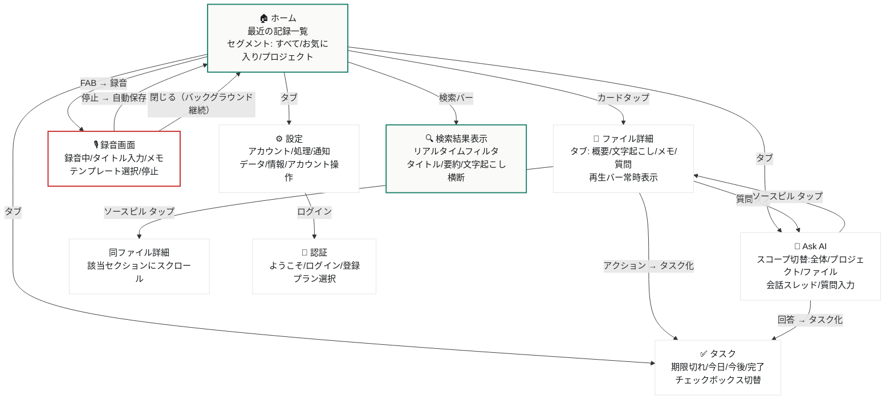
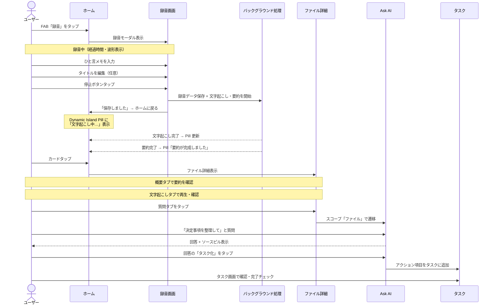
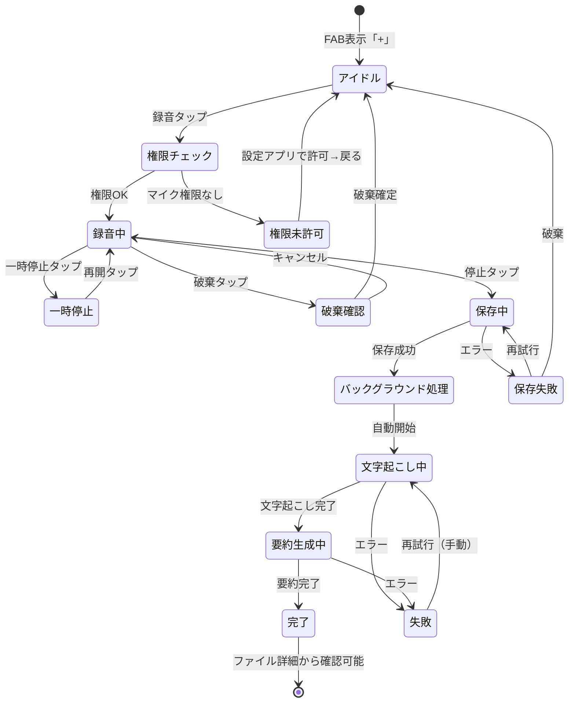
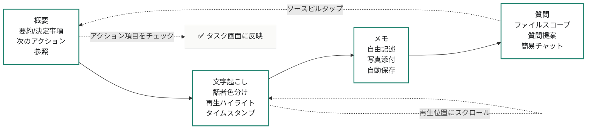
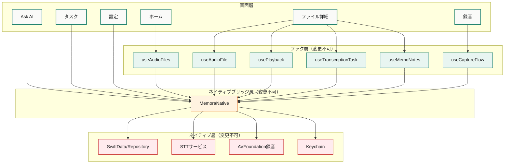

# 画面遷移・情報フロー図

> Memora リデザイン / クリエイティブディレクション成果物
> 更新: 2026-07-14

---

## 全体画面遷移図

---

## 主要ユーザーフロー: 録音 → 保存 → 振り返り → 質問

---

## 状態遷移図: 録音ライフサイクル

---

## ファイル詳細タブ遷移

---

## データフロー: 画面 ↔ データ層

---

## 参照ドキュメント

- `SCREEN_SPECS.md` — 各画面の詳細なProps・状態・日本語文言
- `COMPONENT_MAP.md` — コンポーネントのファイル配置と依存関係
- `CODEX_IMPLEMENTATION_PROMPT.md` — 実装順序とフェーズ分け
