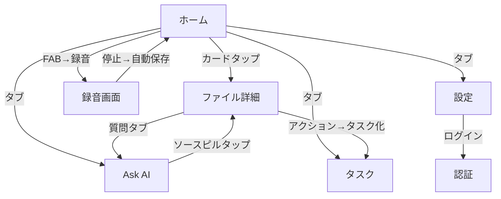

# ビジュアル参照物 生成計画

> クリエイティブディレクション第2巡の成果物計画
> 更新: 2026-07-14

---

## 候補1: コンポーネントスタイルガイド（最優先）

**内容**: DESIGN.md §11 で定義した5コンポーネント（FileCard / SegmentedControl / TabBar / PlayerBar / StatusPill）の正確なビジュアル仕様をFigmaまたはHTMLで可視化。

**使うリソース**:
- `figma-use` MCP → Figmaファイルに直接コンポーネントを描画
- 代替: HTMLでコンポーネントカタログを作成（Figma未接続時のフォールバック）

**成果物イメージ**:
```
┌─ Component Style Guide ──────────────────────┐
│                                               │
│  FileCard (通常)    FileCard (処理中)          │
│  ┌──────────────┐   ┌──────────────┐          │
│  │ 🎙 定例...   │   │ ⟳ 文字起こし中│          │
│  └──────────────┘   └──────────────┘          │
│                                               │
│  SegmentedControl                             │
│  ┌────────────────────────────────┐           │
│  │ [すべて]  お気に入り  プロジェクト│           │
│  └────────────────────────────────┘           │
│                                               │
│  StatusPill (全5状態)                          │
│  [準備完了] [文字起こし中] [要約済] [失敗] [処理中]│
│                                               │
│  PlayerBar                                    │
│  [▶] ────●─────── [32:00] [1×]               │
│                                               │
│  TabBar                                       │
│     概要   文字起こし   メモ   質問              │
│     ════                                     │
└───────────────────────────────────────────────┘
```

**受け入れ条件**:
- 5コンポーネントすべての通常状態が表示されている
- 各コンポーネントのバリアント（active/inactive/disabled/error）が表示されている
- DESIGN.md §2 のカラートークンと一致している
- DESIGN.md §11 の寸法仕様と一致している

---

## 候補2: 画面遷移・情報フロー図

**内容**: SCREEN_SPECS.md の8画面と、ユーザーの主要操作シナリオ（録音→保存→詳細表示→質問→タスク化）のフローを可視化。

**使うリソース**:
- `Mermaid diagrams` MCP → 画面遷移図
- `Excalidraw Architect` MCP → 手描き風の情報フロー図

**成果物イメージ**:


---

## 候補3: 空状態イラスト生成

**内容**: DESIGN.md §12.2 で定義した3種の空状態イラスト（録音開始・検索結果なし・タスクなし）を生成。

**使うリソース**:
- `fal.ai` MCP → `flux-pro-ultra` で線画スタイルのイラスト生成
- 代替: `Pollinations` MCP → AIテキスト→画像

**仕様**:
- スタイル: 線画（line art）、シンプル、`colors.textTertiary` (#9AA0A6) 単色
- サイズ: 200×200px（Retina用に400×400pxで生成し縮小）
- テーマ:
  1. マイクとノート（録音開始を促す）
  2. 虫眼鏡と空の書類（検索結果なし）
  3. チェックリストとペン（タスクなし）

---

## 推奨実行順

1. **候補1（コンポーネントスタイルガイド）** — 実装者が最初に必要とする参照物
2. **候補2（画面遷移図）** — Mermaid は高速に生成でき、実装順序の理解に役立つ
3. **候補3（空状態イラスト）** — 実装後半で必要。fal.ai の生成時間（60-180秒）を考慮

---

## 次のステップ

この計画をレビューし、どの候補から着手するか、または全候補を順次実行するかを指示してください。
