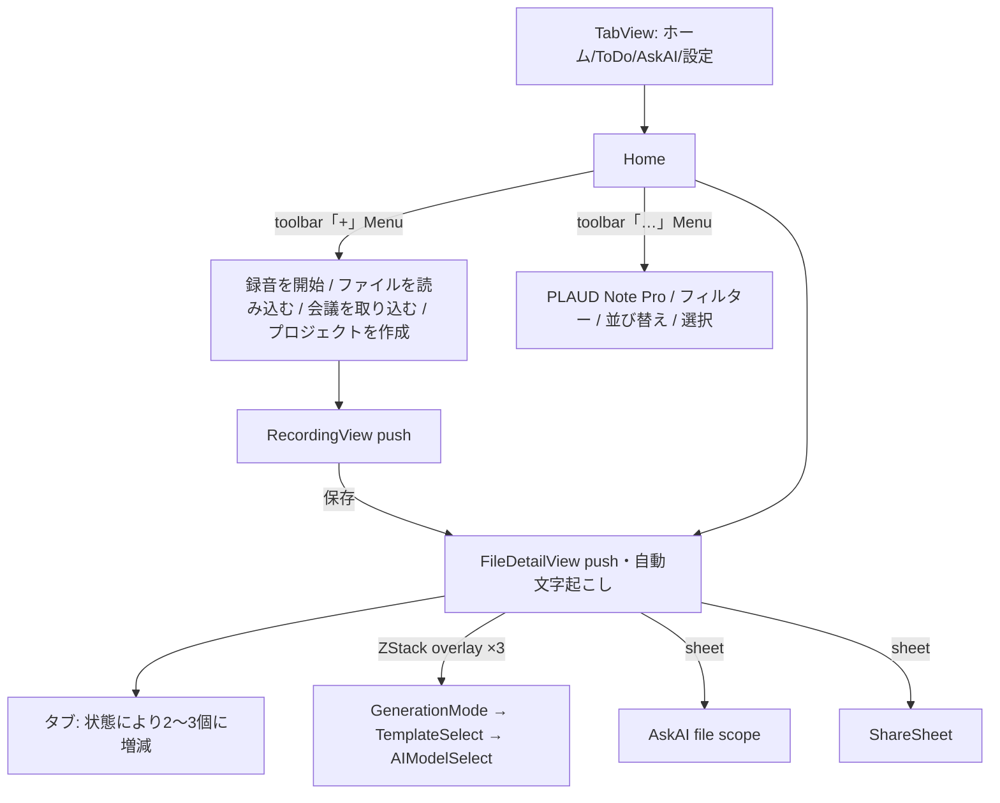
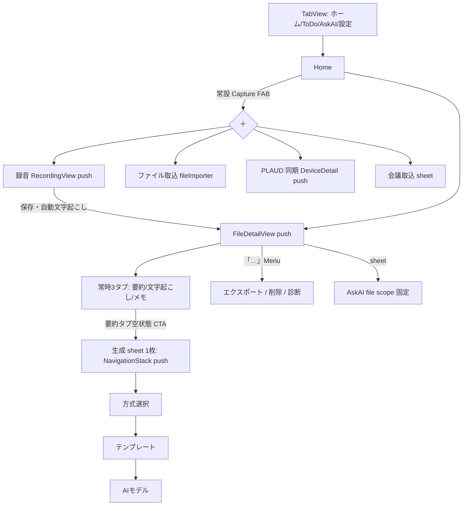

# 01. 画面遷移再設計(PLAUD Note 寄せ)詳細設計書

Lane: A (UI) / STT コア変更: **なし(禁止)** / 依存: なし
対応 PR: PR-A1 〜 PR-A4(§9 参照)

---

## 1. 目的

PLAUD Note の「録音が常に1タップ」「ファイル詳細は常に同じ3タブ」「生成フローは1つのシートで完結」という予測可能な導線に Memora を寄せる。同時に、現状コードにある導線の重複・overlay 3連鎖による状態不整合リスクを除去する。

## 2. 現状(確認済み事実)

### 2.1 現状の遷移構造



### 2.2 コード上の問題点(すべて確認済み)

| ID | 問題 | 場所 |
|---|---|---|
| C-1 | 録音開始が toolbar Menu 内の2タップ目。`FABMenu` コンポーネントは存在するが Home で未使用 | `HomeView.swift` `homeToolbar` |
| C-2 | `showGoogleMeetImport` と `showMeetingCapture` の2つの `@State` が**同じ** `GoogleMeetImportView()` を sheet 表示(重複) | `HomeView.swift` |
| C-3 | `FileDetailTab.availableTabs(for:)` が `notGenerated`/`loading` 時に Summary タブを隠す → タブが増減し空間記憶を壊す。`onChange(of: vm.generationState)` で選択タブの強制付け替えも発生 | `FileDetailTab.swift`, `FileDetailView.swift` |
| C-4 | 要約生成フローが `.sheet` ではなく ZStack overlay 3連鎖(`GenerationModeSheet` → `TemplateSelectSheet` → `AIModelSelectSheet`、各 `zIndex(10)`)。状態フラグが `vm.showGenerationFlow` / `showTemplateSheet` / `showModelSheet` の3系統に分散し、遷移は「前の overlay を false + 次を true」の手動制御。スワイプ dismiss 不可、戻る導線なし | `FileDetailView.swift` `mainContent`, `GenerationModeSheet.swift` |
| C-5 | FileDetail トップバーの「…」ボタンが即・削除アラート(`vm.showDeleteAlert = true`)。「その他」の accessibilityLabel と挙動が不一致 | `FileDetailView.swift` `topBar` |

## 3. 目標遷移構造(To-Be)



設計原則:
1. **Capture は Home のどのスクロール位置からも 1 タップ**(FAB 常設)。
2. **FileDetail のタブは常に3つ**。未生成状態は「タブを隠す」でなく「空状態+CTA」で表現(PLAUD 同様)。
3. **モーダルは iOS 標準 `.sheet` に統一**し、多段選択は sheet 内 `NavigationStack` push で表現(戻る・スワイプ dismiss が無料で手に入る)。
4. 破壊的操作(削除)は必ず Menu 経由。

---

## 4. 変更 S-1: Home に Capture FAB を常設

### 4.1 変更対象
- `Memora/Views/HomeView.swift`(変更)
- `Memora/DesignSystem/Components/FABMenu.swift`(変更なし・既存流用)

### 4.2 設計

- `homeList` を `ZStack(alignment: .bottomTrailing)` で包み、最前面に `FABMenu` を置く。
- FAB items(上から): 録音を開始 / ファイルを読み込む / PLAUD から同期 / 会議を取り込む。
- toolbar の「+」Menu からは **録音/取込系を削除**し、「プロジェクトを作成」のみ残す(FAB と重複させない)。
- 複数選択モード(`isSelectMode == true`)中は FAB を非表示(選択操作と競合するため)。
- FAB 展開中の backdrop は `FABMenu` 既存実装のまま。

### 4.3 実装

`HomeView.swift` に state を追加:

```swift
@State private var isFABExpanded = false
```

`body` 内 `NavigationStack { homeList ... }` の `homeList` を以下に差し替え(モディファイア連鎖はそのまま `ZStack` の外側=NavigationStack 直下のコンテナに残す):

```swift
NavigationStack {
    ZStack(alignment: .bottomTrailing) {
        homeList

        if !isSelectMode {
            FABMenu(isExpanded: $isFABExpanded, items: fabItems)
                .padding(.trailing, MemoraSpacing.lg)
                .padding(.bottom, MemoraSpacing.lg)
        }
    }
    .navigationTitle("ホーム")
    .searchable(text: $searchText, prompt: "検索")
    .toolbar { homeToolbar }
    // 既存の .navigationDestination / .sheet / .fileImporter / .alert / .task /
    // .onChange 群はこのコンテナに残す(移動しない)
}
```

fabItems:

```swift
private var fabItems: [FABMenu.FABItem] {
    [
        .init(icon: "mic.fill", label: "録音を開始") {
            MemoraHaptics.medium()
            showRecordingView = true
        },
        .init(icon: "square.and.arrow.down", label: "ファイルを読み込む") {
            showFileImporter = true
        },
        .init(icon: "waveform", label: "PLAUD から同期") {
            showDeviceDetails = true
        },
        .init(icon: "person.2.waveform", label: "会議を取り込む") {
            showGoogleMeetImport = true
        }
    ]
}
```

toolbar「+」Menu の変更(録音/読み込み/会議の3ボタンを削除):

```swift
ToolbarItem(placement: .topBarTrailing) {
    Menu {
        Button {
            showCreateProject = true
        } label: {
            Label("プロジェクトを作成", systemImage: "folder.badge.plus")
        }
    } label: {
        Image(systemName: "plus")
    }
    .accessibilityLabel("追加")
}
```

### 4.4 重複 sheet の整理(C-2)

- `@State private var showMeetingCapture` を**削除**。
- `.sheet(isPresented: $showMeetingCapture) { GoogleMeetImportView() }` を**削除**。
- `showMeetingCapture = true` としていた箇所(toolbar Menu 内)は S-1 で toolbar から消えるため参照ゼロになることを `grep showMeetingCapture` で確認してから削除。

### 4.5 受け入れ条件(AC)

1. Home 表示中、スクロール位置に関わらず FAB が右下に常に見える(タブバーと重ならない。■確認せよ: `FloatingGlassTabBar`/標準 TabBar との余白。必要なら `.padding(.bottom, 72)` 程度に調整)。
2. FAB → 録音を開始 → `RecordingView` が push され、保存後は従来どおり `FileDetailView` へ遷移し自動文字起こしが走る(既存 `onRecordingSaved` 経路を変更しない)。
3. FAB の4項目すべてが従来と同じ画面に到達する。
4. toolbar「+」には「プロジェクトを作成」のみ。
5. 選択モード中は FAB 非表示。
6. `showMeetingCapture` がコードベースから消えている。
7. VoiceOver で FAB と各項目が読み上げ可能(既存 `FABMenu` の accessibility を流用)。
8. `reduceMotion` 有効時にアニメーションが抑制される(既存実装で担保、目視確認のみ)。

---

## 5. 変更 S-2: FileDetail タブを常時3固定+Summary 空状態 CTA

### 5.1 変更対象
- `Memora/Views/FileDetail/FileDetailTab.swift`(変更)
- `Memora/Views/FileDetail/FileDetailView.swift`(変更)
- `Memora/Views/FileDetail/SummaryTab.swift`(変更なし想定。§5.4 参照)

### 5.2 設計

- `availableTabs(for:)` を廃止し、タブは常に `[.summary, .transcript, .memo]`。
- 初期選択タブロジック `preferredInitialTab(for:)` は維持(要約済みなら summary、文字起こしのみなら transcript…の既存挙動)。■確認せよ: `FileDetailHelpers.swift` / `FileDetailView.swift` 内の該当実装。
- `SummaryTab` は既に「未生成」「文字起こし未実施」の placeholder+「要約を生成」全幅ボタンを実装済み(確認済み)。タブが常時出るようになるだけで空状態表現はそのまま機能する。

### 5.3 実装

`FileDetailTab.swift`:

```swift
/// タブは常時3つ固定。生成状態による増減はさせない(PLAUD 同等の予測可能性)。
static func availableTabs(for state: GenerationState) -> [FileDetailTab] {
    FileDetailTab.allCases
}
```

(呼び出し互換のためシグネチャは残す。将来削除する場合は 09_pr_plan の follow-up へ)

`FileDetailView.swift` の以下の `onChange` を**削除**(タブ強制付け替えが不要になるため):

```swift
.onChange(of: vm.generationState) { _, newState in
    let available = FileDetailTab.availableTabs(for: newState)
    if !available.contains(selectedTab) {
        selectedTab = available.first ?? .transcript
    }
}
```

tabBar 実装(`tabBar(vm:)`)が `availableTabs` を参照している場合はそのまま(常に3つ返るため)。`allCases` 直参照している場合も変更不要。■確認せよ: `tabBar(vm:)` の ForEach 対象。

### 5.4 受け入れ条件(AC)

1. 新規録音直後(未文字起こし)でも要約/文字起こし/メモの3タブが表示される。
2. 要約タブは、文字起こし未実施なら「先に文字起こしが必要です」、文字起こし済み・要約未生成なら「要約をまだ作成していません」+下部「要約を生成」ボタン(既存 `SummaryTab` の分岐がそのまま出ること)。
3. 文字起こし実行中・要約生成中にタブが増減しない。選択中タブが勝手に切り替わらない。
4. 既存の `preferredInitialTab` による初期タブ選択は従来どおり。

---

## 6. 変更 S-3: 要約生成フローを単一 sheet + NavigationStack へ

### 6.1 変更対象
- 新規: `Memora/Views/FileDetail/GenerationFlowNavigationSheet.swift`
- `Memora/Views/FileDetail/FileDetailView.swift`(overlay 3連鎖の除去)
- `Memora/Views/GenerationModeSheet.swift` / `TemplateSelectSheet.swift` / `AIModelSelectSheet.swift`(**中身のコンテンツ View を抽出して再利用**。ファイル自体は残す)
- `Memora/Core/ViewModels/FileDetailViewModel.swift`(`showGenerationFlow` の意味を「sheet 表示」に一本化)

### 6.2 設計

状態モデルを1つに集約する:

```swift
// GenerationFlowNavigationSheet.swift
enum GenerationFlowStep: Hashable {
    case template      // カスタム生成: テンプレート選択
    case model         // AI モデル選択
}
```

- ルート画面 = 方式選択(自動生成 / カスタム生成)。既存 `GenerationModeSheet` の `sheetContent` 相当。
- 「カスタム生成」→ `path.append(.template)` → テンプレート選択 → `path.append(.model)` → モデル選択 → 「生成開始」。
- 「自動生成」→ その場で `onStart(GenerationConfig())` → sheet dismiss。
- dismiss(スワイプ/キャンセル)はどの段からでも可能。状態は sheet 破棄で全消滅(フラグ手動リセット不要)。
- `selectedTemplate: GenerationTemplate` / `selectedModel: AIModelType` は sheet 内 `@State` に閉じる(FileDetailView 側の同名 `@State` 2つは削除)。

### 6.3 実装

新規 `GenerationFlowNavigationSheet.swift`:

```swift
import SwiftUI

/// 要約生成フロー: 方式選択 → (カスタム時) テンプレート → AI モデル → 生成開始。
/// 1枚の sheet + NavigationStack push で完結する。旧 overlay 3連鎖の置き換え。
struct GenerationFlowNavigationSheet: View {
    let onStart: (GenerationConfig) -> Void
    @Environment(\.dismiss) private var dismiss

    @State private var path: [GenerationFlowStep] = []
    @State private var selectedTemplate: GenerationTemplate = .summary
    @State private var selectedModel: AIModelType = .chatGPT5

    var body: some View {
        NavigationStack(path: $path) {
            modeSelectionRoot
                .navigationTitle("要約を生成")
                .navigationBarTitleDisplayMode(.inline)
                .toolbar {
                    ToolbarItem(placement: .cancellationAction) {
                        Button("キャンセル") { dismiss() }
                    }
                }
                .navigationDestination(for: GenerationFlowStep.self) { step in
                    switch step {
                    case .template:
                        TemplateSelectContent(
                            selectedTemplate: $selectedTemplate,
                            onNext: { path.append(.model) }
                        )
                        .navigationTitle("テンプレート")
                    case .model:
                        AIModelSelectContent(
                            selectedModel: $selectedModel,
                            onStart: {
                                onStart(makeConfig())
                                dismiss()
                            }
                        )
                        .navigationTitle("AI モデル")
                    }
                }
        }
        .presentationDetents([.medium, .large])
        .presentationDragIndicator(.visible)
    }

    private var modeSelectionRoot: some View {
        // 既存 GenerationModeSheet の modeRow 2行+生成ボタンを移植。
        // 「自動生成」選択時: onStart(GenerationConfig()); dismiss()
        // 「カスタム生成」選択時: path.append(.template)
        GenerationModeContent(
            onAuto: {
                onStart(GenerationConfig())
                dismiss()
            },
            onCustom: { path.append(.template) }
        )
    }

    private func makeConfig() -> GenerationConfig {
        var config = GenerationConfig()
        config.template = selectedTemplate
        // ■確認せよ: GenerationConfig に model を渡す既存経路。
        // 現状 AIModelSelectSheet が onStartGeneration(config) に何を詰めているかを踏襲する。
        return config
    }
}
```

`GenerationModeContent` / `TemplateSelectContent` / `AIModelSelectContent` は、
既存の 3 sheet ファイルから **背景 dimming・Capsule ドラッグバー・自前 dismiss アニメーションを除いたコンテンツ部分**を `struct` として抽出する。
抽出方針:

- `GenerationModeSheet.swift` → `sheetContent` の VStack(modeRow×2 + generateButton)を `GenerationModeContent(onAuto:onCustom:)` に。dimming `Color.black.opacity(0.4)` と `glassSheetBackground()` の固定高 420 は撤去(sheet が担う)。
- `TemplateSelectSheet.swift` / `AIModelSelectSheet.swift` も同様に、選択リスト+決定ボタンのみを `*Content` に抽出。`isPresented` / `showModelSheet` などの Binding 依存はすべて撤去し、コールバック(`onNext` / `onStart`)に置換。
- 旧 struct 本体は残すが、`FileDetailView` からの参照を外した後 `@available(*, deprecated, message: "GenerationFlowNavigationSheet を使用")` を付ける(削除は follow-up PR)。

`FileDetailView.swift` の変更:

1. ZStack 内の以下 3 ブロックを**削除**:
   - `if vm.showGenerationFlow { GenerationModeSheet(...) .zIndex(10) }`
   - `if showTemplateSheet { TemplateSelectSheet(...) .zIndex(10) }`
   - `if showModelSheet { AIModelSelectSheet(...) .zIndex(10) }`
2. `@State private var showTemplateSheet` / `showModelSheet` / `selectedTemplate` / `selectedModel` を削除。
3. sheet を追加:

```swift
.sheet(isPresented: $vm.showGenerationFlow) {
    GenerationFlowNavigationSheet { config in
        vm.startSummarization(with: config)
    }
}
```

4. `SummaryTab` 等から渡している `showGenerationFlow: Binding<Bool>` は従来どおり `$vm.showGenerationFlow`(呼び出し側変更なし)。

### 6.4 受け入れ条件(AC)

1. 要約タブ「要約を生成」→ sheet が下から出る(medium detent、ドラッグバーあり)。
2. 「自動生成」→ 即 sheet が閉じ、要約生成が始まる(ローディングスケルトン表示は従来どおり)。
3. 「カスタム生成」→ テンプレート → モデル、と push 遷移。**各段で左上戻る**が機能する。
4. どの段でも下スワイプ/キャンセルで dismiss でき、次回開いたときルート(方式選択)から始まる。
5. `showTemplateSheet` / `showModelSheet` state が FileDetailView から消えている。
6. 生成開始後、`vm.startSummarization(with:)` に渡る `GenerationConfig` の内容(template / model)が旧フローと同一(■確認: 旧 `AIModelSelectSheet` の config 組み立てを読み、同値になるよう移植)。
7. `isSummarizing` 中に再度 sheet を開けない(ボタンが従来どおり非表示)。

---

## 7. 変更 S-4: FileDetail「…」を Menu 化(削除の即発火をやめる)

### 7.1 変更対象
- `Memora/Views/FileDetail/FileDetailView.swift` `topBar(vm:)`

### 7.2 実装

「…」ボタン(現状 `vm.showDeleteAlert = true`)を Menu に置換:

```swift
Menu {
    Button {
        vm.showShareSheet = true
    } label: {
        Label("エクスポート / 共有", systemImage: "square.and.arrow.up")
    }

    // 04_home_status_and_failure_ux.md 実装後に有効化:
    // Button { showDiagnostics = true } label: { Label("文字起こし診断", systemImage: "stethoscope") }

    Divider()

    Button(role: .destructive) {
        vm.showDeleteAlert = true
    } label: {
        Label("ファイルを削除", systemImage: "trash")
    }
} label: {
    Image(systemName: "ellipsis")
        .font(.system(size: 16, weight: .medium))
        .foregroundStyle(MemoraColor.textPrimary)
        .frame(width: 44, height: 44)
        .background(Circle().fill(.ultraThinMaterial))
        .overlay(Circle().stroke(MemoraColor.glassBorder, lineWidth: 0.5))
        .shadow(color: MemoraColor.shadowMedium, radius: 8, x: 0, y: 2)
}
.accessibilityLabel("その他")
```

左隣の共有ボタン(独立ボタン)は残してよい(Menu 内はショートカットの重複)。ただし横幅が窮屈なら共有ボタンを削り Menu に一本化する判断を実装者に委ねる(AC はどちらでも満たせる)。

### 7.3 AC

1. 「…」タップで Menu が開き、削除は `role: .destructive`(赤)で表示。
2. 削除タップ → 既存の確認アラート → 削除、の2段確認になる。
3. 「…」から誤タップ一発で削除アラートが出ることがなくなる。

---

## 8. 画面インベントリ(To-Be、リグレッション確認用)

| 画面 | 遷移方式 | 入口 | 備考 |
|---|---|---|---|
| Home | Tab root | — | FAB 常設 |
| RecordingView | push | FAB / (旧 toolbar 経路は廃止) | tabBar hidden 維持 |
| FileDetailView | push | Home 行タップ / 録音保存後 / Omi import 後 | タブ常時3 |
| GenerationFlowNavigationSheet | sheet | SummaryTab CTA / 再生成ボタン | NavigationStack 内 push 2段 |
| AskAIView(file) | sheet | FileDetail Ask Anything overlay | scope 固定 |
| AskAIView(global) | Tab root | タブ | |
| ShareSheet / ExportOptionsSheet | sheet | topBar / タブ内メニュー | 変更なし |
| DeviceDetailView | push | FAB「PLAUD から同期」/ Home device section | |
| GoogleMeetImportView | sheet | FAB「会議を取り込む」 | showMeetingCapture 廃止 |
| CreateProjectView | sheet | toolbar「+」 | |
| FilterSheet | sheet | toolbar「…」 | 変更なし |
| ProjectDetailView | push | Projects segment | 変更なし |

## 9. PR 分割

| PR | 内容 | 変更ファイル |
|---|---|---|
| PR-A1 | S-1 FAB + toolbar 整理 + C-2 重複 sheet 削除 | `HomeView.swift` |
| PR-A2 | S-2 タブ常時3固定 | `FileDetailTab.swift`, `FileDetailView.swift` |
| PR-A3 | S-3 生成フロー sheet 化 | 新規 `GenerationFlowNavigationSheet.swift`, `FileDetailView.swift`, 3 sheet ファイルの Content 抽出 |
| PR-A4 | S-4 「…」Menu 化 | `FileDetailView.swift` |

各 PR は独立してビルド・出荷可能であること。PR-A3 が最大なので、Content 抽出(挙動不変)と sheet 置換を同 PR 内の 2 コミットに分ける。

## 10. 手動 QA チェックリスト(全 PR 共通)

- [ ] 録音 → 保存 → FileDetail 自動遷移 → 自動文字起こし開始
- [ ] ファイル import → 一覧反映 → 詳細を開ける
- [ ] 未文字起こしファイルで3タブ表示、要約タブに正しい空状態
- [ ] 生成フロー: 自動 / カスタム(テンプレ→モデル)/ 途中キャンセル / 各段の戻る
- [ ] 要約再生成(既存要約あり)でも同 sheet が開く
- [ ] 削除は Menu → 確認アラートの2段
- [ ] Dark mode / 最大 Dynamic Type / reduceMotion
- [ ] iPhone SE 相当の狭い画面で FAB とタブバーが干渉しない
