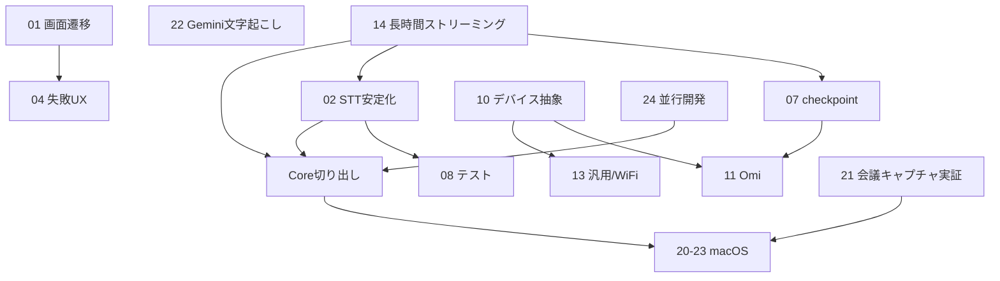

# 31. マスターロードマップ(全体の実装順・優先度)

これは Memora の全設計(STT・UI・デバイス・デスクトップ・長時間対策)を横断した最新の実装計画です。旧 `30_roadmap_and_phasing.md` を置き換えます(デバイス/デスクトップの細かいフェーズは 30 も併読可)。

---

## 1. 優先度の考え方

3つの軸で並べる: **(a) 今困っている度**、**(b) 独立して早く出せる度**、**(c) 他の土台になる度**。

## 2. 全体の推奨実装順

### 🔴 フェーズ 0:「落ちない」を最優先(今いちばんの課題)

| 順 | PR/作業 | ドキュメント | なぜ最初か |
|---|---|---|---|
| 1 | **長時間ストリーミング化**(B9 チャンカー遅延化 / B10 逐次マージ) | 14 §3-4 | クラッシュの直接解決。ユーザーが今困っている |
| 2 | **メモリ/長時間ガード**(B11) | 14 §5 | メモリ警告応答・充電推奨・並列度可変 |
| 3 | **STT 安定化 P0**(B1 cancel / B2 BG / B3 timeout / B4 無音) | 02 | 14 と同じ STT コア。まとめて安定化 |
| 4 | **STT テスト整備**(E1) | 08 §2-4 | 上記の回帰を防ぐ |

> 1-3 はすべて `STTService`/`AudioChunker` を触るので、**同じ担当が連続で**やるのが安全(コンフリクト回避)。14 → 02 の順(まず落ちなくして、次に細部の安定化)。

### 🟠 フェーズ 1:「再開できる」+「早く価値」

| 順 | PR/作業 | ドキュメント | 備考 |
|---|---|---|---|
| 5 | **checkpoint 再開**(C1 モデル / B8 組込) | 07 | 14 のストリーミングループに hooks を差し込む。落ちても再開 |
| 6 | **Gemini 文字起こし + エンジン選択**(Z1) | 22 §3 | iOS 単体で完結・独立・価値大。無料/有料の2系統 |
| 7 | **要約プロバイダ選択**(Z2) | 22 §5 | 無料(Gemini/DeepSeek)/高品質(Claude/GPT) |

### 🟡 フェーズ 2:体験改善(UI、STT コア非依存で並行可)

| 順 | PR/作業 | ドキュメント |
|---|---|---|
| 8 | 画面遷移再設計(A1 FAB / A2 タブ固定 / A3 生成sheet / A4 メニュー) | 01 |
| 9 | 処理中/失敗バッジ + 失敗リカバリ(A6/A7) | 04 |
| 10 | 実タイムスタンプ + 自動スクロール(B5/B6/A5) | 03 |
| 11 | 設定階層化(A8) | 05 |
| 12 | 後付け話者分離(B7/A9) | 06 |

> フェーズ 2 は STT コアを触らない UI が多く(01/04/05)、フェーズ 0-1 と**並行トラック**で進められる。

### 🟢 フェーズ 3:デバイス連携

| 順 | PR/作業 | ドキュメント |
|---|---|---|
| 13 | PLAUD インポート強化(参照 transcript 主格化) | 12 §2 |
| 14 | RecorderDevice 抽象 + Generic 移行(X1) | 10, 13 |
| 15 | **Omi BLE 連携**(X2a PCM疎通 → X2b Opus → X2c 仕上げ) | 11 |
| 16 | Wi-Fi/LAN 取り込み(X4) | 13 §4 |
| (保留) | PLAUD 公式 SDK(法務判断後) | 12 §3 |

### 🔵 フェーズ 4:デスクトップ(並行着手可、Core 切り出しは 0/1 後)

| 順 | PR/作業 | ドキュメント | 並行可否 |
|---|---|---|---|
| 17 | ScreenCaptureKit 音声実証(Core 非依存) | 21 | **今すぐ並行可** |
| 18 | macOS ターゲット雛形(project.yml) | 24 §4 | **今すぐ並行可** |
| 19 | Core 層 SPM 切り出し(Models → AI → Transcription) | 24 §2 | Models は 23 と同時。Transcription は 02/14 後 |
| 20 | CloudKit + SwiftData 同期(read-only → 双方向) | 23 | Models 切り出しと同時 |
| 21 | 会議録音(システム音声 → マイク合成) | 21 | 17 の後 |
| 22 | macOS の文字起こし・要約(Core 利用) | 22 | Transcription 切り出し後 |

---

## 3. 3つの並行トラック

実装リソースが複数あるなら、この3トラックを並行できる:

```
トラック STT(1人が連続で):  14 → 02 → 07 → 06/03 のSTT部分
トラック UI(別担当):        01 → 04 → 05 → 03/06 のUI部分 → 22 のUI
トラック デスクトップ(別):   21実証 → macOS雛形 → (Core切り出し待ち) → 会議録音
```

デバイス連携(フェーズ3)は STT/UI が一段落してから、または3人目がいれば並行。

## 4. 依存関係グラフ(要点)



要点:
- **14 が STT 系すべての土台**(落ちない状態を先に作る)。
- **Core 切り出し(19)は 02/14 完了が前提**(改修中のファイルを動かさない)。
- **21(会議キャプチャ)と macOS 雛形は完全独立**で今すぐ着手可。

## 5. 「今週から並行で始められること」

| トラック | 今すぐ着手 |
|---|---|
| STT | **14(長時間クラッシュ対策)** — 最優先 |
| UI | 01(画面遷移)または 22 のエンジン選択 UI |
| デスクトップ | 21(ScreenCaptureKit 音声実証)+ macOS 雛形 |

## 6. リスクと緩和(統合版)

| リスク | 緩和 |
|---|---|
| 長時間でまだ落ちる | 14 を実機の実メモリ(Instruments)で検証。3時間→ピーク一定を確認してからリリース |
| 14 と 07 のコンフリクト | 14 を先にマージ。07 は 14 適用後の runTask を前提に書く |
| Core 切り出しが iOS を壊す | 02/14 完了後、モジュール単位で段階移行、各段でビルド確認 |
| Omi 実機がプロトコル想定と違う | X2a で PCM 疎通、Wireshark/ログ検証してから Opus |
| PLAUD 規約抵触 | BLE 解析禁止。インポート方式で代替。SDK は法務判断後 |
| Gemini 無料枠の学習利用 | エンジン選択制+警告。既定はオンデバイス |
| 会議録音の法令 | 録音前同意確認、録音中インジケータ |

## 7. まとめ(3要望への最終回答)

1. **統合パッケージ** = このマスターパッケージ。差分でなく全部入り。
2. **デスクトップ並行** = 24 の Core 共有戦略で。ScreenCaptureKit 実証と macOS 雛形は今すぐ並行可、Core 切り出しは 02/14 後。
3. **長時間クラッシュ** = 14 のストリーミング化で根本解決。最優先で着手。
